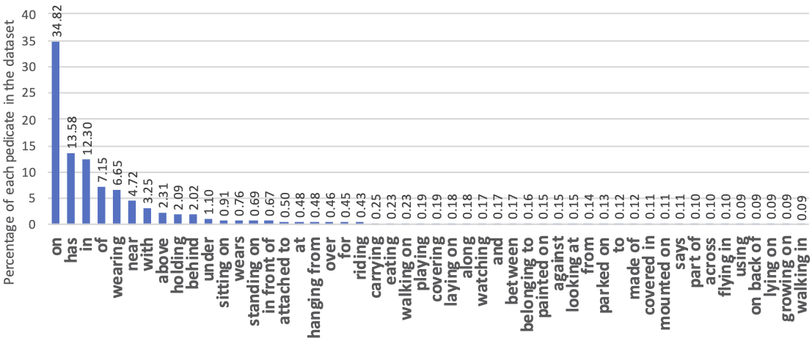
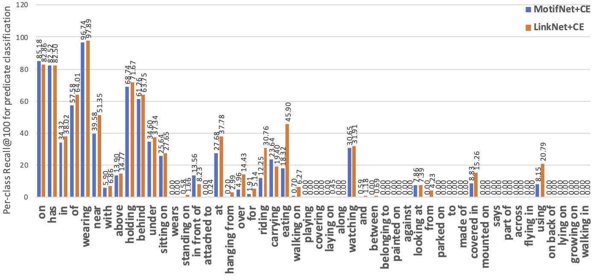
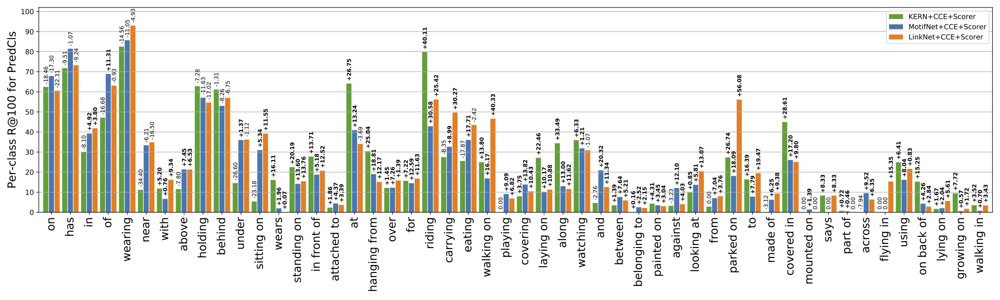
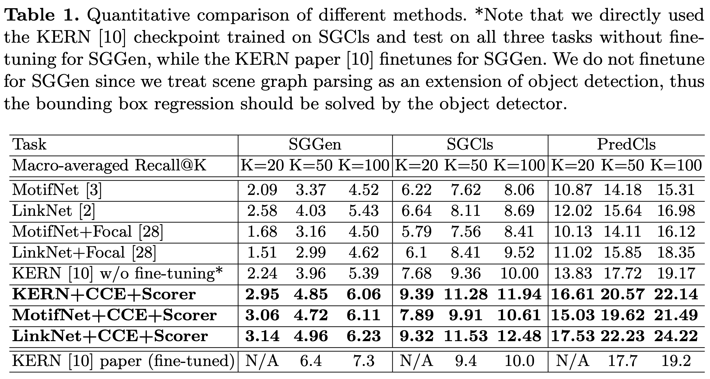

# Addressing Class Imbalance in Scene Graph Parsing by Learning to Contrast and Score

He Huang, Shunta Saito, Yuta Kikuchi, Eiichi Matsumoto, Wei Tang, Philip S. Yu

Part of this work was done while He Huang was an intern at Preferred Networks.

[Paper](https://arxiv.org/abs/2009.13331) published in ACCV'2020.

In this paper, we propose to factorize  scene graph parsing as a combination of classification and ranking problems and propose a contrasting cross-entropy (CCE) loss and a Ranker module to address these two tasks repectively. Experiments show that our framework is able to help several scene graph models alleviate the class imbalance problem in scene graph parsing. 

This repo is built on top of these sources:
[neural-motifs](https://github.com/rowanz/neural-motifs)
[LinkNet](https://github.com/jiayan97/linknet-pytorch)

Core modifications are in `lib/ranker.py` and `train_rels.py`.

This repo currently only support LinkNet training, since the other baselines in the paper are still in PyTorch v0.3.

## Setup
- Install Python3.6 & PyTorch: `conda install pytorch torchvision cudatoolkit -c pytorch`
- Install additional packages: `conda install numpy scipy ipdb tqdm`.
- Download Visual Genome dataset, see `data/stanford_filtered/README.md` for details.

## Train
1. Train Object Detection ([You can also download the pretrained detector checkpoint here.](https://drive.google.com/open?id=11zKRr2OF5oclFL47kjFYBOxScotQzArX))

```
CUDA_VISIBLE_DEVICES=0,1,2 python train_detector.py -b 6 -lr 1e-3 -save_dir checkpoints/vgdet -nepoch 50 -ngpu 3 -nwork 3 -p 100 -clip 5
```

2. Train Scene Graph model with CCE loss and ranker:

```
CUDA_VISIBLE_DEVICES=0 python train_rels.py -m sgcls -model linknet -b 10 -clip 5 -p 100 -hidden_dim 256 -pooling_dim 4096 \
-lr 1e-4 -ngpu 1 -ckpt checkpoints/backup/vgdet/vg-24.tar -save_dir checkpoints/linknet-sgcls-cce-rank \
-nepoch 30 -use_bias -loss cce -lambda1 100 -lambda2 1 -m1 0 -use_rank
```

## Test
See `eval_pred.sh`, `eval_sgc.sh` and `eval_sgd.sh` for details.


## Class imbalance in the Visual Genome dataset
Below is the predicates distribution in Visual Genome, where predicates are sorted by their frequencies.


Below is the recall@100 for each predicate generated by LinkNet and MotifNet trained with cross-entropy.


## Results
Below is the changes in recall@100 for each predicate generated by LinkNet and MotifNet trained with our proposed framework.


